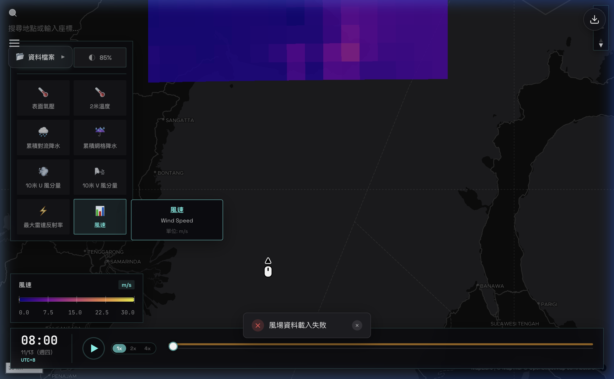
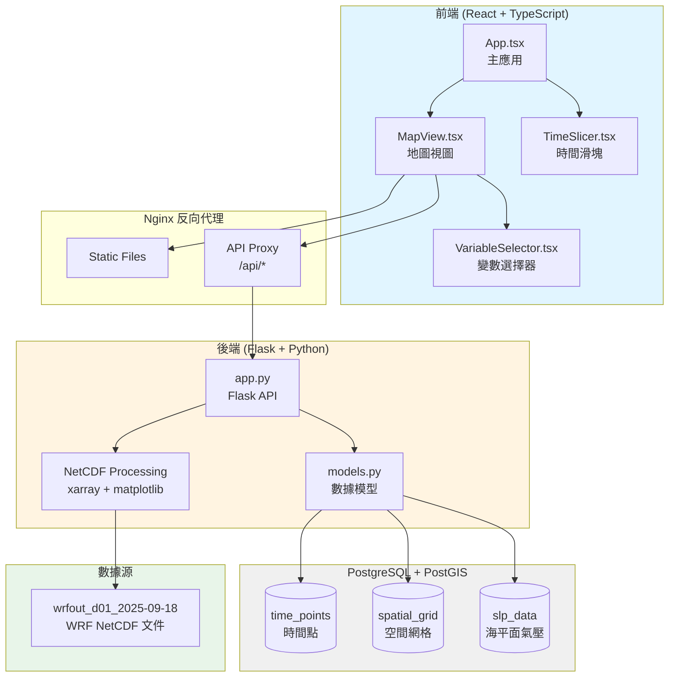

# Maritime Platform - 海事平台技術文檔


## 專案概述

Maritime Platform 是一個基於 Web 的氣象數據可視化平台，專門用於展示和分析 WRF (Weather Research and Forecasting) 模型輸出的氣象場數據。系統支持多種氣象變數的交互式可視化，包括溫度、氣壓、降水、風場等。

### 核心功能

- **交互式地圖可視化**: 使用 MapLibre GL 在地圖上疊加氣象數據
- **多變數選擇**: 支持 7 種基本氣象變數的切換顯示
- **時間序列動畫**: 通過時間滑塊查看氣象場的時間演變
- **高性能渲染**: 使用 matplotlib pcolormesh 生成連續平滑的網格可視化
- **東亞區域聚焦**: 默認地圖中心在台灣附近（121°E, 24°N）

---

## 系統架構



---

## 技術棧

### 前端
- **框架**: React 18 + TypeScript
- **構建工具**: Vite 7.0
- **地圖庫**: MapLibre GL JS
- **樣式**: CSS Modules

### 後端
- **Web 框架**: Flask (Python 3.9)
- **數據處理**: 
  - xarray - NetCDF 文件讀取
  - numpy - 數值計算
  - matplotlib - 數據可視化
- **ORM**: SQLAlchemy + GeoAlchemy2
- **WSGI 服務器**: Gunicorn

### 資料庫
- **PostgreSQL 13** + **PostGIS 3.3** 擴展

### 容器化
- **Docker** + **Docker Compose**

---

## 目錄結構

```
maritime-platform/
├── backend-service/              # 後端服務
│   ├── app.py                   # Flask 主應用
│   ├── models.py                # SQLAlchemy 數據模型
│   ├── import_data.py           # 數據導入腳本
│   ├── requirements.txt         # Python 依賴
│   └── Dockerfile
│
├── web-client/                  # 前端應用
│   ├── src/
│   │   ├── components/
│   │   │   ├── MapView.tsx      # 主地圖組件
│   │   │   ├── TimeSlicer.tsx   # 時間選擇器
│   │   │   └── VariableSelector.tsx  # 變數選擇器
│   │   ├── App.tsx
│   │   └── main.tsx
│   ├── nginx.conf
│   └── Dockerfile
│
├── data/                        # WRF 數據文件
├── db_init/                     # 資料庫初始化
├── docker-compose.yml
└── README.md
```

---

## API 端點

### `GET /variables`
獲取所有可用的氣象變數列表

**支持的變數**:
- `PSFC` - 表面氣壓 (hPa)
- `T2` - 2米溫度 (°C)
- `RAINC` - 累積對流降水 (mm)
- `RAINNC` - 累積網格降水 (mm)
- `U10` - 10米 U 風分量 (m/s)
- `V10` - 10米 V 風分量 (m/s)
- `REFD_MAX` - 最大雷達反射率 (dBZ)

### `GET /variable_data`
獲取指定變數的可視化圖像

**參數**:
- `time` (int): 時間索引
- `variable` (string): 變數 ID

**示例**: `/variable_data?time=5&variable=T2`

### `GET /time_points`
獲取所有時間點

---

## 安裝與運行

```bash
# 1. 配置環境變數
echo "VITE_MAPTILER_API_KEY=your_key" > .env

# 2. 啟動服務
docker-compose up -d

# 3. 訪問應用
http://localhost/
```

---

## 版本歷史

### v1.1.0 (2026-01-16)
- ✨ 新增變數選擇功能
- 🐛 修復圖像渲染問題
- 🎨 改用 matplotlib pcolormesh
- 🌏 默認地圖中心移至東亞

---

*最後更新: 2026-01-16*
