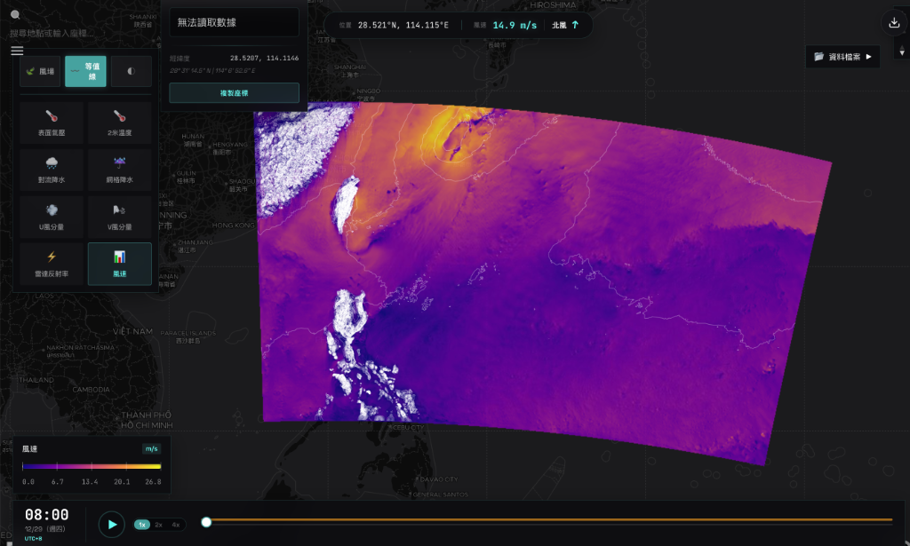
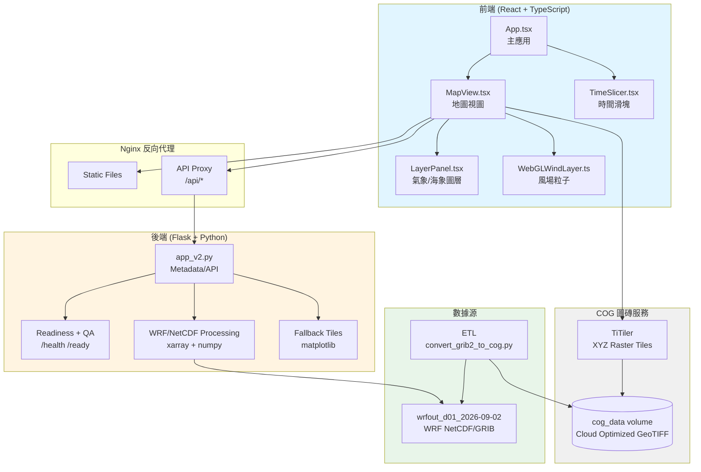

# Maritime Platform - 海事平台技術文檔


## 專案概述

Maritime Platform 是一個基於 Web 的氣象數據可視化平台，專門用於展示和分析 WRF (Weather Research and Forecasting) 模型輸出的氣象場數據。系統支持多種氣象變數的交互式可視化，包括溫度、氣壓、降水、風場等。

### 核心功能

- **交互式地圖可視化**: 使用 MapLibre GL 在地圖上疊加氣象數據
- **多變數選擇**: 支持氣象與海象圖層分組，缺資料欄位會保留規劃但在 UI 禁用
- **時間序列動畫**: 通過時間滑塊查看氣象場的時間演變
- **高性能渲染**: 優先使用 COG + TiTiler 圖磚，缺 COG 時自動回退動態圖磚
- **風場粒子動畫**: 使用 WebGL 顯示類 Windy 的流線粒子
- **作業狀態列**: 顯示目前 WRF 檔案、時間步、範圍、COG/ETL 與海象資料狀態
- **東亞區域聚焦**: 默認地圖中心在台灣附近（121°E, 24°N）

---

## 系統架構


```mermaid
graph TB
    subgraph Frontend["前端 (React + TypeScript)"]
        A[App.tsx<br/>主應用]
        B[MapView.tsx<br/>地圖視圖]
        C[TimeSlicer.tsx<br/>時間滑塊]
        D[LayerPanel.tsx<br/>氣象/海象圖層]
        W[WebGLWindLayer.ts<br/>風場粒子]
    end
    
    subgraph Nginx["Nginx 反向代理"]
        E[Static Files]
        F[API Proxy<br/>/api/*]
    end
    
    subgraph Backend["後端 (Flask + Python)"]
        G[app_v2.py<br/>Metadata/API]
        H[Readiness + QA<br/>/health /ready]
        I[WRF/NetCDF Processing<br/>xarray + numpy]
        R[Fallback Tiles<br/>matplotlib]
    end

    subgraph Tiling["COG 圖磚服務"]
        T[TiTiler<br/>XYZ Raster Tiles]
        O[(cog_data volume<br/>Cloud Optimized GeoTIFF)]
    end
    
    subgraph Data["數據源"]
        M[wrfout_d01_2026-09-02<br/>WRF NetCDF/GRIB]
        X[ETL<br/>convert_grib2_to_cog.py]
    end
    
    A --> B
    A --> C
    B --> D
    B --> W
    B --> E
    B --> F
    F --> G
    G --> I
    G --> H
    G --> R
    I --> M
    X --> M
    X --> O
    T --> O
    B --> T

    style Frontend fill:#e1f5ff
    style Backend fill:#fff4e1
    style Tiling fill:#f0f0f0
    style Data fill:#e8f5e9
```

---

## 技術棧

### 前端
- **框架**: React 19 + TypeScript
- **構建工具**: Vite 7.0
- **地圖庫**: MapLibre GL JS
- **渲染**: Raster tiles + WebGL 風場粒子
- **樣式**: CSS

### 後端
- **Web 框架**: Flask + Gunicorn (Python 3.11)
- **數據處理**: 
  - xarray - NetCDF 文件讀取
  - numpy - 數值計算
  - scipy/rasterio/pyproj - 網格與地理資料處理
  - matplotlib - 動態 fallback tile

### 圖磚與容器化
- **COG**: WRF/GRIB 預處理成 Cloud Optimized GeoTIFF
- **TiTiler**: COG → XYZ raster tiles
- **Docker** + **Docker Compose**
- **PostgreSQL/PostGIS**: 保留為後續帳號、任務、空間索引等商業功能基礎

---

## 目錄結構

```
maritime-platform/
├── backend-service/              # 後端服務
│   ├── app_v2.py                # Flask API + WRF metadata
│   ├── etl_bridge.py            # ETL 觸發與狀態
│   ├── tile_cache.py            # fallback tile cache
│   ├── wind_texture.py          # WebGL 風場 texture encoding
│   ├── qa_test.py               # live API smoke test
│   ├── tests/                   # pytest
│   ├── requirements.txt         # Python 依賴
│   └── Dockerfile
│
├── web-client/                  # 前端應用
│   ├── src/
│   │   ├── components/
│   │   │   ├── MapView.tsx      # 主地圖組件
│   │   │   ├── TimeSlicer.tsx   # 時間選擇器
│   │   │   ├── LayerPanel.tsx   # 氣象/海象圖層面板
│   │   │   └── WebGLWindLayer.ts # 風場粒子
│   │   ├── App.tsx
│   │   └── main.tsx
│   ├── nginx.conf
│   └── Dockerfile
│
├── etl/                         # WRF/GRIB → COG pipeline
├── data/                        # WRF 數據文件
├── db_init/                     # PostgreSQL/PostGIS 初始化
├── .github/workflows/ci.yml     # PR/push 自動 CI
├── .env.example                 # 部署環境變數範本
├── docker-compose.yml
└── README.md
```

---

## API 端點

### `GET /health`
Liveness check。只代表 API process 可回應，用於判斷服務是否活著。

### `GET /ready`
Readiness check。確認資料檔可解析、座標可讀、至少一個變數可用、時間步有效；Docker healthcheck 與 integration QA 以此作為部署門檻。

### `GET /version`
回傳 backend 服務名稱、版本、git SHA、build date 與目前資料檔名，供部署稽核、客服支援與客戶現場排查使用。

### `GET /metrics`
Prometheus text format。輸出 HTTP request count、status class、request latency sum、rate limit reject count 與 tile/wind/coords cache 指標，可接 Prometheus、Grafana、Uptime Kuma 或其他監控系統。

### `GET /variables`
獲取所有可用的氣象變數列表

**支持的氣象變數**:
- `PSFC` - 表面氣壓 (hPa)
- `T2` - 2米溫度 (°C)
- `RAINC` - 累積對流降水 (mm)
- `RAINNC` - 累積網格降水 (mm)
- `U10` - 10米 U 風分量 (m/s)
- `V10` - 10米 V 風分量 (m/s)
- `REFD_MAX` - 最大雷達反射率 (dBZ)
- `WSPD` - 10米風速 (m/s)
- `T_LEV` / `P_HYD` / `WSPD_LEV` / `REFL_10CM` - 垂直層資料

**支持的海象變數（資料存在時啟用）**:
- `SST` - 海表溫度 (°C)
- `WAVE_HS` - 有效波高 (m)
- `WAVE_TP` - 主波週期 (s)
- `WAVE_DIR` - 波向 (°)
- `CURRENT_SPD` - 海流速 (m/s)
- `SSH` - 海面高度或潮位異常 (m)

### `GET /variable_stats`
獲取指定變數、時間與垂直層的色階範圍與圖層 metadata

**參數**:
- `time` (int): 時間索引
- `variable` (string): 變數 ID
- `level` (int): 垂直層索引，預設 0

**示例**: `/variable_stats?time=5&variable=T2&level=0`

### `GET /time_points`
獲取所有時間點

### `GET /model_summary`
獲取目前資料檔、時間步、地理範圍、可用變數數、海象變數數與 ETL/COG 狀態

### `GET /time_series`
獲取指定經緯度、變數與垂直層的時間序列，供點擊地圖後的資料檢視使用。

**參數**:
- `lat` (float): 緯度
- `lon` (float): 經度
- `variable` (string): 變數 ID
- `level` (int): 垂直層索引，預設 0

**示例**: `/time_series?lat=24&lon=121&variable=T2&level=0`

---

## 營運設定

| 環境變數 | 用途 |
|----------|------|
| `VITE_MAPTILER_API_KEY` | 前端底圖服務金鑰 |
| `BUILD_VERSION` | 版本號或 release tag，會進 image label 與 `/version` |
| `BUILD_SHA` | git commit SHA，會進 image label 與 `/version` |
| `BUILD_DATE` | UTC build timestamp，會進 image label 與 `/version` |
| `NETCDF_PATH` | 優先載入的 WRF/NetCDF/GRIB 檔案 |
| `NETCDF_DATA_DIR` | `NETCDF_PATH` 不存在時的資料掃描目錄 |
| `API_KEY` | 選填；設定後 private API 需要 `X-API-Key` 或 `Authorization: Bearer` |
| `COG_ROOT` | COG 產物目錄，供 TiTiler/manifest 使用 |
| `ETL_AUTO` | 選擇資料檔後是否自動觸發 COG ETL |
| `CORS_ORIGINS` | 允許的前端來源，正式部署請改成實際網域 |
| `LOG_LEVEL` | 後端 log level，例如 `INFO` 或 `DEBUG` |
| `RATE_LIMIT_PER_MINUTE` | 選填；大於 0 時啟用每來源每分鐘請求上限 |
| `RATE_LIMIT_WINDOW_SECONDS` | rate limit 視窗秒數，預設 60 |
| `TILE_CACHE_SIZE` | 動態 fallback tile LRU cache 容量 |
| `WIND_CACHE_SIZE` | 風場與座標 texture cache 容量 |

後端所有 response 會加上基本安全 header，包含 `X-Content-Type-Options`、`X-Frame-Options`、`Referrer-Policy` 與 `Permissions-Policy`。

`API_KEY` 留空時維持本機開發模式；正式部署可設定 `API_KEY`。Docker Compose 會把同一個 `API_KEY` 傳給 backend 與 web-client，Nginx 會在 server-side proxy `/api/*` 時注入 `X-API-Key`，瀏覽器只看到同源 `/api`，不會拿到後端 secret。若改用外部 Ingress、VPN 或 API Gateway，也應在代理層加 header，不要把後端 API key 編進公開前端 bundle。

資料檔選擇 API 只允許切換 `NETCDF_DATA_DIR` 內的 `wrfout*`、`.nc`、`.nc4`、`.grib`、`.grib2` 檔案，避免後端被要求讀取資料目錄外的本機檔案。

`RATE_LIMIT_PER_MINUTE=0` 表示不限流；公開 demo 或正式試用環境建議設定為合理上限，例如 `600`。目前內建 limiter 是 per-process in-memory，適合單機與 MacBook Pro M2 Docker 部署；多 replica 環境應改由 Ingress、API Gateway 或 Redis-backed limiter 做全域限流。

## 安裝與運行

```bash
# 1. 配置環境變數，不要提交 .env
cp .env.example .env
# 編輯 .env，填入 VITE_MAPTILER_API_KEY 與 WRF 資料路徑

# 2. 放入 WRF/NetCDF/GRIB 檔案
mkdir -p data
# 預設路徑: data/wrfout_d01_2026-09-02_00:00:00

# 3. 啟動服務
make up          # 或 docker compose up -d

# 4. 確認 API 已可服務
curl http://localhost:6000/ready

# 5. 訪問應用
http://localhost/
```

## 工程化工具鏈

| 指令 | 說明 |
|------|------|
| `make test` | 前端 Vitest + 後端 pytest |
| `make lint` | ESLint/tsc + ruff（若已安裝） |
| `make ci-local` | 本機 CI：前端 lint/typecheck/test/build + 後端 py_compile/pytest |
| `make qa` | 對運行中後端跑 API smoke test |
| `make release-check` | 交付前 release gate：CI、compose、secret/data ignore、真實資料 readiness/version/metrics |
| `make notices` | 從 lockfiles 重產第三方依賴授權清單 |
| `make etl` | WRF/GRIB → COG 批次轉檔 |
| `make load-test` | 併發測試動態圖磚 + 查看 cache hit rate |

**ETL 狀態** `curl http://localhost:6000/etl/status` — 選檔後 `running:true`，完成後 `files_created>0`。idle 表示尚未觸發轉檔。

CI：`.github/workflows/ci.yml` — PR/push 自動跑 frontend lint/typecheck/test/build 與 backend py_compile/pytest；需要 Docker + WRF sample data 的 integration QA 由 `workflow_dispatch` 手動開啟。

CI 也會檢查 Docker Compose 可解析，以及 web-client Nginx template 是否保留 server-side `X-API-Key` 注入設定。

正式 build image 時建議注入 release identity：

```bash
BUILD_VERSION=v1.2.0 \
BUILD_SHA=$(git rev-parse --short HEAD) \
BUILD_DATE=$(date -u +%Y-%m-%dT%H:%M:%SZ) \
docker compose build
```

受 API key 保護的環境可這樣跑 smoke test：

```bash
API_KEY=your_backend_api_key BACKEND_URL=http://localhost:6000 make qa
```

交付前在 MacBook Pro M2 本機跑：

```bash
BUILD_VERSION=v1.2.0 \
BUILD_SHA=$(git rev-parse --short HEAD) \
BUILD_DATE=$(date -u +%Y-%m-%dT%H:%M:%SZ) \
make release-check
```

`release-check` 會確認 `.env`、`web-client/.env`、`data/` 大檔未被提交，Docker Compose 可解析，Nginx server-side API key 注入仍存在，並用真實 WRF 檔驗證 `/ready`、`/version`、`/metrics`。

## 商業化交付文件

- [營運手冊](./docs/OPERATIONS.md): release readiness、部署、監控、資料流程、備份還原與客戶交接
- [資安基線](./docs/SECURITY.md): secrets、API protection、網路控管、資料保護與正式 SaaS 缺口
- [第三方授權清單](./docs/THIRD_PARTY_NOTICES.md): npm/Python 依賴與需人工複核的授權項目
- [版本紀錄](./CHANGELOG.md): 產品、部署、營運與資安變更紀錄

`make release-check` 會檢查上述交付文件存在且 README 保留入口。若要交付給客戶或做 demo，請把 release gate 結果、版本號、git SHA、build date 與目標 WRF 檔名一起記錄。

---

## 版本歷史

### v1.1.0 (2026-01-16)
- ✨ 新增變數選擇功能
- 🐛 修復圖像渲染問題
- 🎨 改用 matplotlib pcolormesh
- 🌏 默認地圖中心移至東亞

---

*最後更新: 2026-09-02*
